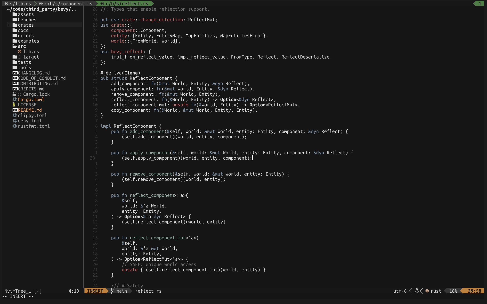

# Slightly Clownish

Based on the ````no-clown-fiesta```` color scheme, with just a little bit more clowny-ness




## Usage

To enable this colorscheme:

```vim
colorscheme slightlyclownish
```

```lua
vim.cmd[[colorscheme slightlyclownish]]
```

To override the default settings you need to call setup before enabling the
colorscheme. slightlyclownish will use these settings, unless you call setup
and override these.

```lua
require("slightlyclownish").setup({
  transparent = false, -- Enable this to disable the bg color
  styles = { 
    -- You can set any of the style values specified for `:h nvim_set_hl`
    comments = {},
    keywords = {},
    functions = {},
    variables = {},
    type = { bold = true },
  },
})
```

## Supported Plugins

- Alpha
- Git
- Hop
- Lir
- LSP
- Lualine
- Markdown
- Neogit
- NvimCmp
- NvimTree
- Telescope
- Treesitter
- StatusLine (the default non custom one)
- WhichKey
